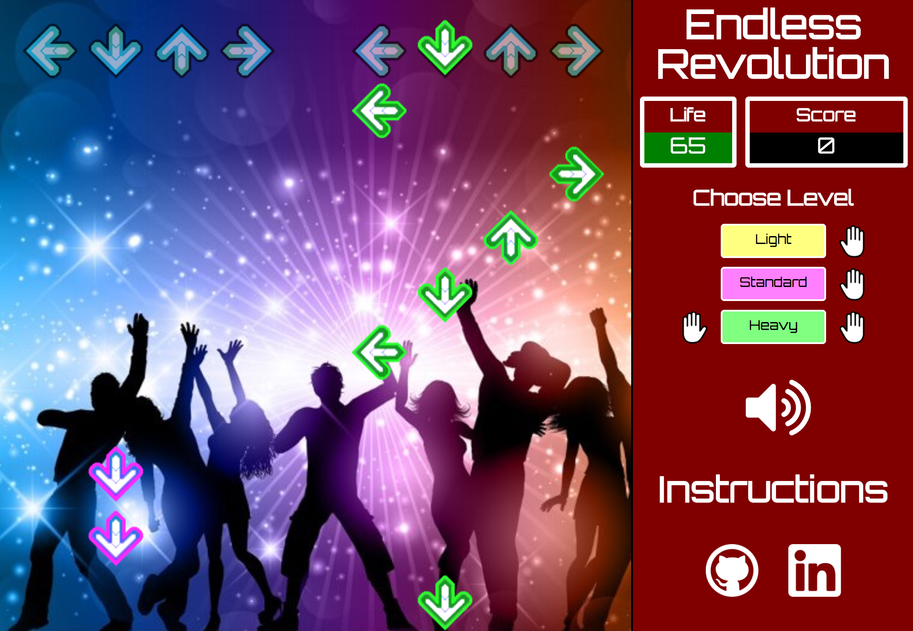

## Kevin Kevin Revolution

### Background

[Kevin Kevin Revolution][live] is an implementation of the popular 4-arrow rhythm game Dance Dance Revolution where players must press corresponding arrow keys as they scroll past the top line of arrows. The twist is that the gameplay doesn't end until the user misses too many consecutive arrows and causes life points to reach 0.

Kevin Kevin Revolution is a twist on Endless Revolution, originally created by Gary Yeh.

[live]: https://nrsorens.github.io/endless.html

### Instructions

* Choose a level (Light, Standard, Heavy) to begin/restart

  (Only in "Heavy" mode are you required to play with both hands)

* Press the corresponding arrow key right when an arrow crosses the top row of gray arrows

* You start with 100 life. Missed keypresses deduct your life points while successful presses increase them, up to 200.

* If your life hits 0, the game ends!
